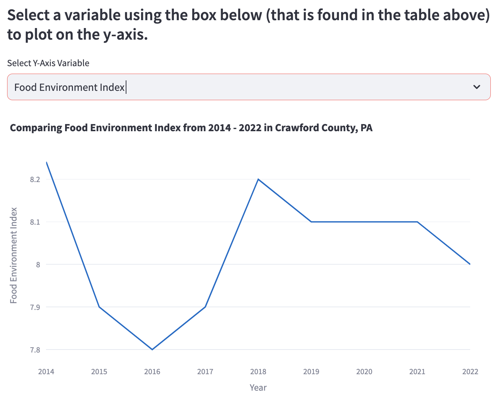
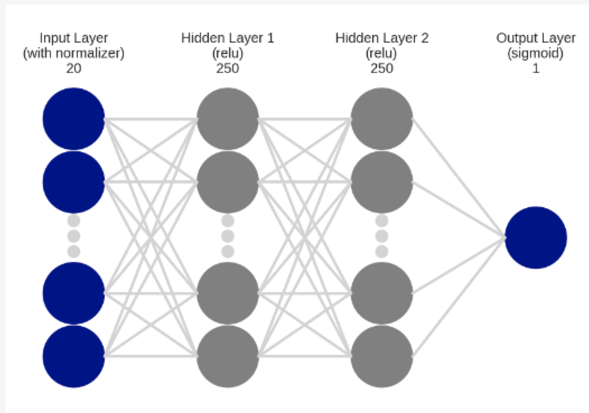

# Acknowledgements
&nbsp;&nbsp;&nbsp;&nbsp;&nbsp;I would like to first thank my first reader Oliver Bonham-Carter for pushing me to succeed and to work for my dreams of tackling food insecurity. Without his academic support, I would not have made it thus far. Another thanks to not only for being my first reader but also for assisting me throughout all of his classes. A final thanks for also being my academic advisor, and helping me understand the importance of informatics and data science when I had to declare my major as a sophomore. I also wanted to thank my second reader, Janyl Jumadinova, for reading through my senior project.  Thank you to Michael Williams and the rest of the Crawford County Food Alliance for allowing me to work with them during my Community-Based Research project of the summer and fall of 2023. This research project allowed me to be exposed to the topic of food insecurity, and gain inspiration to help others by tackling this problem.  An overall thanks goes to my professors, faculty, and other administrators I have worked with. I would not be the student I am today without all the love and support from everyone.

I want to give a special wholehearted thanks to my Mom, Dad, Taylor, Pap, Nonnie, and Uncle Johnny for loving and supporting me through my entire college career. I truly would not be in the position I am today without you. I would also like to acknowledge some of my closest friends and peers; Meredythe Baird, Tyler Miller, Molly Miller, Hana Miller, Maya Francisco, Jenna Cassani, Debbie Nalesnik, my girlfriend Hannah Hinterleiter, and the Allegheny College Club Ice Hockey Team. You all mean the world to me, and I will never forget all of the amazing memories I created with you guys. I can’t thank everyone enough for always being there for me. I am also so proud of what everyone has accomplished and for never giving up.   I would not be the person I am today without any of you.  All in all, I wanted to give thanks to myself. I started my college career without knowing where Allegheny would take me career-wise, and I am now one week from graduating knowing exactly where my interests are. Allegheny has also allowed me to find myself as a person and helped me to build my character every day at a time. I am leaving Allegheny College proud of myself and with a long-lasting impact that I hope others can follow.

# Introduction

[**GitHub Repository: https://github.com/ReadyResearchers-2023-24/Ryan-Kennedy-Artifact**](https://github.com/ReadyResearchers-2023-24/Ryan-Kennedy-Artifact)

&nbsp;&nbsp;&nbsp;&nbsp;&nbsp;Food Insecurity can be defined as “the limited or uncertain availability of nutritionally adequate and safe foods, or limited or uncertain ability to acquire acceptable foods in socially acceptable ways” by the Life Sciences Research Office and the United States Department of Agriculture (USDA) [@nutritionalstate1990]. Some of its causes include poverty and unemployment, lack of affordable housing, lack of transportation, chronic health conditions, racism, and discrimination against vulnerable populations [@feedingamerica1]. Although the awareness of the country’s food insecurity challenges grew among many Americans in 2021 due to the COVID-19 pandemic, the phenomenon was not new [@beyondfooddeserts]. Even before the pandemic, the prevalence of moderate to severe food insecurity had continued on a downward trajectory following the Great Recession ending in 2009 [Bauer]. However, directly before the pandemic began, 10.5% of U.S. households still faced food insecurity [@beyondfooddeserts]. This rate was highest amongst households with incomes below the poverty line (34.9%) and single-mother households (28.7%) [@beyondfooddeserts]. Latino or Hispanic and Black households experienced food insecurity rates of 15.6% and 19.1%, disproportionately higher than white households (7.9%) [@beyondfooddeserts]. From February - May 2020, the COVID-19 pandemic caused a drastic rise in unemployment, a loss of access to school meals, and a decrease in food supply chains [@beyondfooddeserts]. This then contributed to food insecurity rates doubling amongst all households, and tripling amongst households with children in this same period (Figure 1.1) [@RisenFoodInsecurity]. Very low food security among children also doubled from February - June 2020 (Figure 1.1) [@thanksgiving2020]. Overall food insecurity rates then declined for the remainder of summer 2020 due to income support remaining from federal fiscal support packages passed at the beginning of the year, declining unemployment as states reopened their economies, and children returning to school, expanding their reach of school meal programs (Figure 1.1) [@thanksgiving2020]. On an annual scale, 2020 ended with 10.5% of all households being food insecure (Figure 1.2). While there was some progress by the end of 2021, as the rate of all households went down to 10.2%, the rate had spiked drastically to 12.8% by the end of 2022 (Figure 1.2). This is the highest it has been since 2015, and the second quickest spike since the Great Recession from 2007 - 2008 (Figure 1.2) [@USDA1]. This spike is a direct result of the COVID-19 pandemic. High food price inflation, and elevated costs for other basic needs, such as transportation and rent, have eroded food budgets, and safety net responses that buffered food insecurity in 2021 are no longer in place [@highinflation2022].

![**Figure 1.1** Line-chart visualizing trends in food-insecurity among all households, households with children, and very low food-insecurity among children from 2006 - November 9, 2020. Food-insecurity measures assess whether households have enough money for adequate food consumption. Very low food-insecurity measures assess children who miss necessary meals and do not consume enough nutrients. Information gathered from U.S. Census Bureau (Households Pulse Survey); Current Population Survey Food Security Supplement 2006-2018; Schanzenback and Tomeh 2020. This graph can be found in The Hamilton Project Brookings’ *Hungry at Thanksgiving: A Fall 2020 update on food insecurity in the U.S.* [@thanksgiving2020]](images/Figure 1.1.png)

![**Figure 1.2:** Line-chart visualizing trends in the prevalence of food-insecurity and very low food-insecurity in U.S. households from the years 2001 - 2022. Information gathered from USDA’s Economic Research Service calculations using the Current Population Survey Food Security Supplement data. This graph can be found in the USDA’s *Food Security in the US, Interactive Charts and Highlights*. [@USDA1]](images/Figure 1.2.png)

Food insecurity may have serious consequences on one’s physical and mental health, well-being, or social life [@USDA1]. The most common effects specifically include, but are not limited to, malnutrition, hunger, chronic heart disease, diabetes, depression, anxiety, stress, hyperactivity, social isolation, stigma, difficulty concentrating, low energy, and missing school or work [@feedingamerica1]. 17 million (13%) households were food-insecure in the United States, experiencing one or more of these symptoms by the end of 2022 [@USDA1]. This also consisted of 44.2 million people who lived in these households. This was significantly higher than in 2021, where 13.5 million (10%) households were food-insecure. Those 17 million households in 2022 are then broken down into two categories of food insecurity: low food security and very low food security.  Low food security occurs when households obtain enough food to avoid substantially disrupting their eating patterns or reducing food intake by using a variety of coping strategies, such as eating less varied diets, participating in Federal food assistance programs, or obtaining food from community food pantries.  Very low food security occurs when one or more household members’ normal eating patterns are disrupted and food intake is reduced due to insufficient funds or other resources for food.  Out of the 17 million households in 2022, 10.3 million (7.7%) had low food security, and 6.8 million (5.1%) had very low food security (Figure 1.3) [@USDA1].

![**Figure 1.3:** Pie-chart of food security status percentages of all households in the U.S. in the year 2022. Information gathered from USDA, Economic Research Service using data from U.S. Department of Commerce, Bureau of the Census, and 2022 Current Population Survey Food Security Supplement. [@USDA1]](images/Figure 1.3.png)

Often when comparing statistics of food-insecure households in any given area in the United States, one of the largest portions that make them up are households with children. Out of the 17 million food-insecure households in 2022, 6.4 million (17.3%) households had children under the age of eighteen (Figure 1.4) [@USDA1]. However, in some of these households, only adults were food-insecure (3.2 million or 8.5% of households), while in others, children also experienced food insecurity with adults (3.3 million or 8.8% of households) (Figure 1.4). Overall, 7.3 million children lived in these types of households, experiencing many of the common effects of food insecurity described in the previous paragraph. While it is true children are usually protected from reductions in food intake even in households with low food insecurity, one or more children still experienced reduced food intake and disrupted eating patterns within 381,000 (1.0%) of households with children (Figure 1.4) [@USDA1]. 

![**Figure 1.4:** Pie-chart of food security status percentages of adults with children of all households in the U.S. In most instances, when children are food insecure, the adults in the households are also food insecure. Information gathered from USDA, Economic Research Service using data from U.S. Department of Commerce, Bureau of the Census, 2022 Current Population Survey Food Security Supplement. This graph can be found in the USDA’s *Food Security in the US, Interactive Charts and Highlights*. [@USDA1]](images/Figure 1.4.png)

Another large portion of food-insecure households includes people of color. Out of the 17 million food-insecure households in 2022, American Indian or Alaska Native populations equated to 23.0%, Black populations for 22.4%, Hispanic populations for 20.8%, Asian, Native Hawaiin, or Pacific Islander populations to 6.4%, and the category of Other for approximately 23.0% (Figure 1.5) [@children2022inequalities]. Furthermore, White/non-Hispanic populations equated to 9.3% of households (Figure 1.5). These statistics reflect the systematic racism and discrimination within the root causes of poverty such as housing, healthcare, education, and employment which make it difficult to afford enough food to eat [@children2022inequalities]. Neighborhoods of people of color may also have fewer full-service supermarkets or grocery stores than predominantly White and non-Hispanic neighborhoods [@humanservices2023]. Finally, A study in Detroit found that people living in low-income predominantly Black neighborhoods travel an average of 1.1 miles farther to the closest supermarket than those living in low-income predominantly White neighborhoods [@Detroitsupermarkets].

![**Figure 1.5:** Households of different races and ethnicities that lacked access to adequate food at some point in the year from the years 2010-2022. “Other race” refers to people who are more than one race. AlAN refers to people who are American Indian or Alaskan Native. ANHPI refers to people who are Asian, Native Hawaiian, or Pacific Islanders. Hispanic households may be of any race. Race and ethnicity for the households are based on that of the household reference person (in whose name the housing unit is owned or rented). Information gathered from U.S. Department of Agriculture, Current Population Survey Food Security Supplement 2010-2022. This graph can be found in the Center on Budget and Policy Properties’ *Food Insecurity Increased in 2022, With Severe Impact on Households With Children and Ongoing Racial Inequities* [@children2022inequalities]](images/Figure 1.5.png)

While the awareness of food insecurity in the United States has grown drastically over recent decades, evidence suggests that this problem has still increased alarmingly as a direct cause of the COVID-19 pandemic. This has left vulnerable groups to deal with the consequences, with new individuals joining them at a rapid pace. In direct response to the pandemic, the USDA provided resources to food pantries through The Emergency Food Assistance Program (TEFAP) [@foodpantry2021]. In 2020, TEFAP supplied 2.2 billion pounds of USDA foods (including nutritious foods such as fruits, vegetables, eggs, meat, poultry, fish, nuts, milk and cheese, and rice, cereal, and pasta) to community emergency food providers [@foodpantry2021]. In the fall of 2022, the USDA announced it would provide approximately $1.5 billion in funding given by the Commodity Credit Corporation for domestic food purchases to be distributed through the TEFAP [@Feedingamerica2]. In the spring of 2023, an additional $1 billion in funding from the Commodity Credit Corporation was announced. This additional funding is helping to address supply chain disruptions, decreased food donations, increased food purchase and transportation costs, and the continued higher demand food banks are facing [@Feedingamerica2]. To additionally combat food insecurity, food assistance programs such as the National School Lunch Program (NSLP), and the Women Infants and Children (WIC) program, break the barriers to access healthy food consistently [@humanservices2023]. Furthermore, examples of other food resources include qualified food banks, pantries, or trucks; family support centers, food charities, community gardens, meal programs for seniors, farmers’ markets, community kitchens, or nutrition education programs.

## 1.1 Motivation
&nbsp;&nbsp;&nbsp;&nbsp;&nbsp;With the rapid emergence of food insecurity rates, so is the need for new, accessible food support resources. Not only did the pandemic cause rises in unemployment, food costs, and many other implications, but it also caused food-insecure individuals to heavily rely on government aid and pandemic-related food assistance benefits [@beyondfooddeserts]. For example, this can especially be seen in the Supplemental Nutrition Assistance Program (SNAP) [@2millionamericans]. From the fiscal year of October 2021 - September 2022, 41.2 million people in 21.6 million households received monthly SNAP benefits on average [@foodstamps2023]. However, when SNAP benefits were discontinued shortly after this in March 2023, recipients experienced a 21% relative increase in both overall food insecurity, and food insecurity among children [@2millionamericans]. This implies that more than two million additional American households faced food insecurity when SNAP benefits ended [@2millionamericans]. This has left the rest of 2023 for even more individuals who relied on these benefits to find other ways of acquiring adequate and nutritious food. However, this is not to say that the other current wide variety of food resources is not beneficial in reducing food insecurity rates. An individual in need who seeks aid from a food resource will receive adequate food if they meet the specific qualifications of that resource.  Nonetheless, there is a disconnect between food-insecure people and the current resources available, proven through the ongoing increase of food insecurity rates. This relates to individuals being uneducated, unaware, or unable to access food resources available in their environment.

The most food-insecure states between 2020 - 2022 included Oklahoma, Texas, Louisiana, Missouri, Arkansas, and South Carolina (Figure 1.6) [@USDA1]. Each of these states fell above the national average of 11.2% food-insecure households. [@USDA1]. However, some states that were above the national average may have had counties that did not suffer from food insecurity as severely as others. Likewise, this does not mean that states and counties that fell below the national average still did not suffer from food insecurity. Factors such as county population density, or the size of each county are also important to keep in mind when comparing them against one another. A prime example of this is Crawford County, Pennsylvania. Pennsylvania fell beneath the national average from 2020 - 2022, where 10.1% of households were food-insecure [@Pennsylvania2023]. In 2021, Crawford County ranked eleven out of sixty-seven counties in PA for having high food insecurity [@feedingamerica3]. 9,830 people (11.8%) of the population were food-insecure [@feedingamerica3]. In 2023, 9,898 people (12%) of the population will be food-insecure [@crawford2023pa]. This conveys that although Pennsylvania has relatively low food insecurity (falling beneath the national average) there are still counties within it that are continuing to suffer. Over time, counties such as Crawford may cause Pennsylvania to be pushed over the national average, and increase overall state food insecurity. Creating the Crawford County Food Insecurity Dashboard (CCFID) will visually display interactive current food resources and statistics about this county, and it will be the answer to prevent food insecurity from increasing.

![**Figure 1.6:** Heat map of the U.S. visualizing which U.S. states were above, near, or below the national food insecurity average (11.2%) from the years 2020-2022. States that are categorized as “near U.S. average” have prevalence rates not statistically significantly different from the U.S. average. Information gathered from USDA, Economic Research Service using data from U.S. Department of Commerce, Bureau of the Census, 2020, 2021, and 2022 Current Population Survey Food Security Supplements. This map can be found in the USDA’s *Food Security in the US, Interactive Charts and Highlights*. [@USDA1]](images/Figure 1.6.png)

## 1.2 Current State of the Art
&nbsp;&nbsp;&nbsp;&nbsp;&nbsp;Although food-insecure populations in Crawford County, Pennsylvania are high and are continuing to rise, community members and governmental organizations are aware of this problem and have taken action. Establishing interactive visualizations and other food resources is the most efficient way to make food-insecure populations aware and educated about the options available for them to receive aid.  A notable example is The Crawford County Food Alliance. This food alliance was established in 2020 in response to the COVID-19 pandemic, and is composed of a network of non-profit organizations in collaboration with students and faculty members of Allegheny College, and other community members [@ccfa2023]. Their goal is to “provide access to information about all local food resources in Crawford County.” [@ccfa2023] After the completion of multiple research projects between students and community members of the county since 2020, they created their own website in 2023 to store these research projects in one central location. These research projects included: a food resource guide, food access calendar, and food map. The food resource guide is a Google Doc that provides information on qualified food banks, pantries, and trucks. This information consists of each resource’s name, address, possible bus routes, website link, phone number, a brief description, hours of operation, possible fees, qualifications, and other services they provide. It also includes the criteria for individuals to qualify for receiving food stamps [@ccfa2023]. The food access calendar is a Google Calendar that includes the same food resources in the food resource guide, but they are visually listed in a calendar format [@ccfa2023]. This format lets users know which days of the week each resource provides their services. Users can also see a brief description of each resource by clicking on them. Finally, the food map is a Google Map that includes each food resource listed in the food resource guide and food access calendar, and visually plots them on a map of Crawford County [@ccfa2023]. Users can navigate around the map, zoom in and out, and click on each plot of each resource to see its name, address, and a brief description. This allows users to know the distance between themselves and the closest food resources, as well as which ones they would be interested in receiving food from.

On a broader scale, Feeding America has produced an interactive map that features annual food insecurity estimates from their Map the Meal Gap study. This map displays data collected for the overall population, children, different races and ethnicities, and senior populations in every county, congressional district, and state, as well as for every service area within the nationwide network of food banks updated from 2011 - 2021 [@feedingamerica3]. Users can scroll to, type in the search bar, and click on any of these regions, including Crawford County, and filter what type of population and year to look at. Data estimates include the amount of food-insecure people, food insecurity rate, nutrition program eligibility, percent of the population above or below SNAP and other nutrition programs threshold of 200% poverty, average meal cost, and annual food budget shortfall. The goal of this map is to develop effective strategies to address the root causes of food insecurity and change the systems, policies, and practices that put people at risk of hunger.” [@feedingamerica3]

Finally, the USDA has also produced an interactive map, called the Food Access Research Atlas, highlighting census tracts below specific income levels, supermarket proximity, and vehicle access thresholds from 2015 - 2019 [@beyondfooddeserts]. Users can filter what types of shaded regions to display on the map, which include low-income and low-access layers, showing distances between one and twenty miles to the nearest supermarket for walking or vehicle access [@USDA2].  Users are then able to scroll, zoom in and out, and click on shaded areas on the map to view results about the selected area [@USDA2]. Some of these regions can be found in Crawford County. The purpose of this map is to identify food deserts. Food deserts have been defined by the Farm Bill in 2008 as “areas in the United States with limited access to affordable and nutritious food, particularly such as an area composed of predominantly lower-income neighborhoods and communities.” [@desertpolicy2014]

While Feeding America’s interactive map, and the USDA’s Food Access Research Atlas efficiently help to present alarming statistics and food deserts within Crawford County to policymakers, researchers, or organizations working in the field of food insecurity, and educate food-insecure populations about the environment they live in, these resources have not accurately targeted these audiences. A food-insecure individual is not able to use Feeding America’s interactive map to understand how they can gain any benefit in terms of taking action to improve their food security by learning about where or how they can acquire food, as the only information presented are detailed statistics they may be uneducated about. Although policymakers, researchers, or public health organizations can use these statistics to develop new policies or research, the map’s data has not been updated since 2021, which was before the extreme spike in food insecurity in the US (Figure 1.2) [@feedingamerica3]. While a food-insecure person, policymaker, researcher, or public health organization was able to use the USDA’s Food Access Research Atlas to locate food deserts, they are not able to do so anymore because the map’s data is also outdated. The latest data entries were from 2019, a period when the state of food insecurity was unaffected by the COVID-19 pandemic [@USDA2]. While these two resources have the capability of looking at individual counties in the US, a food-insecure person living in Crawford County would have a more difficult time finding these resources, as their main goal is to cover the entire US, not specifically focusing on Crawford County. For this reason, a resource such as the CCFA’s website is the most important and effective. It specifically looks at relevant and updated food resources from 2023 in Crawford County, and it is more likely to be found and used by residents of the county itself. However, in terms of presenting data and visualizations for policymakers, researchers, or public health organizations, Feeding America’s interactive map and the USDA’s Food Access Research Atlas are the most important and effective for this reason. Nonetheless, these three resources are noteworthy examples of why similar resources, such as the CCFID, are needed.

## 1.3 Goals of the Project
&nbsp;&nbsp;&nbsp;&nbsp;&nbsp;While food insecurity rates in Crawford County, Pennsylvania, and the United States as a whole, continue to rise, a need for an interactive, relevant, online food security resource persists. Evidence suggests that there needs to be more resources made specifically for Crawford County. Key features of the CCFID will include geospatial mapping, time trends, and food assistance program impacts. Geospatial mapping will consist of implementing visual representations of food insecurity data plotted on a map, allowing users to see regional variations, hotspots, transportation availability, or food support locations such as food banks. Time trends refer to displaying charts and graphs describing changes in food insecurity rates over time, assisting users in understanding trends or patterns. Food assistance program impacts refer to describing information on the effectiveness of programs such as NSLP [@humanservices2023], or specific food banks. Different types of analyses will be integrated throughout the dashboard including comparative, and predictive analysis. Demographic analyses will consist of breaking down factors such as age, income, household size, or other relevant variables. Comparative analyses will consist of comparing food insecurity metrics across different geographic areas or demographic groups. Finally, predictive analyses will consist of models to estimate future food insecurity trends based on current and historical data.

The CCFID will pull interactive visualization ideas from resources such as Feeding America’s interactive map [@feedingamerica3], the USDA’s Food Access Research Atlas [@USDA2], the CCFA’s website [@ccfa2023], or other resources from community or governmental organizations. For this dashboard to become relevant and remain an active online resource, various types of data will be frequently pulled from multiple different sources such as the CCFA, the USDA, County Health Rankings and Roadmaps, or other food resources such as food banks. Simultaneously, the dashboard must visually present the data and other informative text in a way that is most accessible to be interacted with and educated about. Additionally, the desired audience needs to be aware of the existence of the dashboard for any progress to be made. For this to occur, the dashboard must be hosted on an online platform such as a website or app, and communicated efficiently.

While the CCFID will be evaluated for the accuracy of related food insecurity data and resources, and how they are presented in terms of accessibility and readability, impacts on target food-insecure populations will not be measured within the dashboard itself. To determine the efficiency of the dashboard, user interactions should be analyzed from a third-party source or tool with the following hypothesis in mind:

**Hypothesis:** Food insecurity rates and populations in Crawford County will decrease by the end of 2025 after enough users have become aware of the dashboard. Food-insecure populations will become educated about the food resources included within it.

The CCFID, with its ability to educate food-insecure populations, and aid policymakers, researchers, and organizations working in the field of food security and public health using unique interactive visualizations and text, will eventually reach the status of being integrated into governmental agencies, research institutions, or nonprofit and community organizations. This tool provides a new avenue for visualizing and analyzing trends, predictions, and impacts of food insecurity data. With the introduction of this tool to the internet, food-insecure populations and those working in the realm of public health will experience a more engaging learning environment, where they can be informed of existing food resources, and food insecurity statistics, trends, and predictions. To achieve this goal of public health integration, the CCFID must be scaled for proper deployment for usage among possible website or app hosts. With the proposed future work for this tool, the CCFID will reach a point in health informatics and data analyses to allow for its extension and full integration into the educating and analyses forming of public health and data science.

# Related Works

## 2.1 Interactive Food Desert Maps
&nbsp;&nbsp;&nbsp;&nbsp;&nbsp;Decades prior to the COVID-19 pandemic, academics, advocates, and policymakers have denoted that unequal geographic access to food is the problem for high food insecurity percentages in the United States [@beyondfooddeserts]. This is what gave rise to the concept of a “food desert.” This notion resonated with media and practitioners, giving rise to lists of food support locations being produced for a push to bring fresh food directly to deprived neighborhoods. However, there are structural issues with only focusing on the ridding of food deserts. First, most people shop beyond their neighborhood for food. Food deserts also do not consider digital delivery services, which reduces individuals from traveling from their homes. Finally, the food desert narrative does not address financial insecurity, which is a primary factor that drives food insecurity [@beyondfooddeserts]. As food insecurity has dramatically increased in the US, as a result of the pandemic, the concept of geographic food access for today’s digital economy must be updated, and policies that will meet the need to increase people’s buying power with their ability to acquire food must be reconsidered [@beyondfooddeserts].

In the mid-20th century, many communities throughout the US had a milkman and horse-drawn wagons that delivered meat, fish, and vegetables to doorsteps [@yeomanresilience]. Food sharing across fence lines to family and friends was also a common practice to ensure everyone had enough to eat. An example of this was the neighborhood of Deanwood, Washington D.C. Deanwood also had eleven different grocery stores that opened between 1930-40, which were owned by African-American and Jewish families. However, as of 2018, there were exactly zero grocery stores, and the only places for Deanwood’s 5,000 residents to purchase food were corner stores, abundantly stocked with beer, Beefaroni, and other products of sugary, and fatty foods. They were also deprived of fruit, vegetables, and meat. The concept of food sharing over fence lines was also a past practice. The nearest supermarket from the neighborhood was approximately 30 minutes in walking distance on a hilly path. These types of neighborhoods and regions across the US came to be known as “food deserts.” As this problem in the US began to gain traction before the pandemic, the nonpartisan D.C. Policy Center created an interactive map that revealed roughly half of Deanwood was in a food desert [@yeomanresilience].

Since the 1990s, most food access literature has been framed around the “food desert” term [@beyondfooddeserts]. These areas have visually been identified through various forms, one of which includes plotting them on interactive maps. Specific examples include the interactive map developed by the nonpartisan D.C. Policy Center that visually located them on a local scope for Washington D.C. (particularly for the neighborhood of Deanwood) [@yeomanresilience], and the Food Access Research Atlas developed by the USDA that located them at a national perspective [@beyondfooddeserts]. The Washington D.C. map consists of tools where users can highlight ward boundaries, grocery stores, food deserts, walkshed areas, median household income areas, and areas of car inaccessibility (Figure 2.1) [@washingtonDCFD]. The tools in the Food Access Research Atlas map allow users to display census tracts below certain incomes, supermarket proximity, and vehicle access thresholds (Figure 2.2) [@USDA2]. Other interactive maps have attempted to refine food access metrics by incorporating transit, bicycle, and walking thresholds; measuring travel time, price distance, or street distance rather than calculating traditional Euclidean distance; transit and store schedules, or nuanced socioeconomic indicators [@beyondfooddeserts].

![**Figure 2.1:** Food desert map of the Deanwood neighborhood in Washington D.C. This map was made by Randy Smith on the geospatial data software CARTO, and can be found on Civil Eats’ *The Hidden Resilience of ‘Food Desert’ Neighborhoods* [@yeomanresilience]](images/Figure 2.1.png)

![**Figure 2.2:** U.S. map visualizing all low-income and low-food access areas (food deserts) from 2015-2023. Food Access Research Atlas curated by the USDA. [@USDA2]](images/Figure 2.2.png)

Research by the USDA between 1990-2000 has drawn links between neighborhood-level food access, generational redlining and segregation, and the role of structural racism in the national food system [@beyondfooddeserts].  However, in recent literature, scholars and activists increasingly critique the concept of a food desert as stigmatizing, inaccurate, and insufficient to characterize established structural inequalities [@desertwonderings]. These critiques demonstrate a convincing need to reframe approaches to concurring food injustice. They argue that interactive food desert maps, which aim to visually illustrate food inequality, can reproduce problematic assumptions, stigmas, and inaccuracies. For example, food desert maps usually overlook community assets, and focus on decontextualized and overdetermined indicators such as supermarket proximity and transportation access. Furthermore, scholars and activists propose several alternative mapping practices which include critical cartography and counter-mapping, community asset mapping, participatory geographic information systems, and radical cartography. They hope that these alternative approaches potentially move practitioners and viewers beyond the emphasis on “desert”, and more towards a detailed understanding of community food access [@desertwonderings].

Recent literature also focuses on how the food desert narrative is hindered by technical limitations and false assumptions about how food-insecure individuals navigate their food environment [@beyondfooddeserts]. An underlying assumption in nearly all food access mapping is that individuals prefer to shop at the food supplier closest to their home. However, the National Household Food Acquisition and Purchase survey, conducted by the USDA in 2015, found that the average American household does not shop for food at the retailer closest to their home [@AmericanShops]. A separate study by the USDA Economic Research Service in 2009 noted that those living in low-income, low-access areas were more likely to shop for food near their workplace than their home [@2009FoodAccess]. Community-driven food security strategies are also overlooked. Communities often provide food access through small grocers, community gardens, farmers’ markets, food banks, and other programs, especially if there is a lack of supermarkets, according to a 2007 study of the San Francisco Bay Area and a 2015 study of Detroit.  Finally, food desert analyses tend to strictly define a community’s socioeconomic and food establishment conditions within general borders of census tracts, municipalities, or counties. However, food-insecure individuals do not actively consider if they are crossing one of these borders while traveling to a grocery store. As food retailers tend to choose locations precisely adjacent to busy and easily accessible roads, which often run along census tracts and other geographic boundaries, residents in a tract with no grocery store may realistically live directly across the street from one (Figure 2.3). Food access maps rely on less accurate methods of dulling the effects of this technical limitation, compared to methods such as constructing buffers around areas of study, formally termed the “edge effect” [@beyondfooddeserts].

![**Figure 2.3:** Example of the “edge effect” that limits food access visually displayed on a map. Low-income and low-food access census tracts directly border grocery stores. Census tracts were categorized as “low-income” and “low-food access” at the following distances: 1 (urban) and 10 (rural) miles, 5 (urban) and 10 (rural) miles, and 1 (urban) and 20 (rural) miles according to the 2019 USDA Food Access Research Atlas. Grocery icons indicate a Walmart Neighborhood Market and Walmart located on the census tract borders. Information gathered from USDA Food Access Research Atlas and Google Maps grocer location data. This map can be found in Brookings’ *Beyond ‘food deserts’: America needs a new approach to mapping food insecurity*. [@beyondfooddeserts]](images/Figure 2.3.png)

In a 2014 study of SNAP, the USDA stated “Geographic access to food was generally not associated with the percentage of households that were food-insecure.” [@beyondfooddeserts] Even if universal access to food retailers and support locations was perfect, millions of Americans would not be able to meet their household needs. The food desert narrative overlooks the basic relationship between supply and demand. Increasing the supply of food will only increase consumption if there is enough demand to meet it. Food demand is suppressed among lower-income households. These households spend less than one-third of what high-income households spend on food each year. Furthermore, food expenses account for a share of 36% of their disposable income, which forces low-income families to make impossible decisions between food, medicine, heating and cooling, housing, and education [@beyondfooddeserts].

While it is evident that scholars and activists call for a new approach to designing interactive food maps and reforming the concept of “food deserts,” this is not to say that geography is not an important component of concurring food insecurity. A community is guaranteed to be healthier if there are more private food distributors within a reasonable travel distance. Food-insecure individuals can benefit from emerging delivery services if they are within delivery service areas, and they can afford an internet subscription. Offering more affordable transportation services, especially for low-income households, can allow for more trips to people’s preferred food providers [@beyondfooddeserts]. Plotting variables such as food distributors, delivery service areas, and transportation routes on an interactive map made available and targeting a specific region will benefit food-insecure populations searching for resources, and policymakers who have the power to change the national or local food system. Although identifying food deserts is important to understand what areas lack nutritional and consistent food abundance, they should not be the main focus when creating interactive food maps, especially when identifying vulnerable populations that reside in these areas.

## 2.2 Comparative Analysis
&nbsp;&nbsp;&nbsp;&nbsp;&nbsp;To enhance the understanding and informed decision-making of both food-insecure populations and policymakers regarding the realities of food environments throughout regions of the United States, it is crucial to comprehensively collect, analyze, and present food insecurity data. Creating visual results from comparative and predictive analyses of data that these groups contribute to will reduce food insecurity rates. Specifically for interactive food access maps, comparing geographic variables such as, but not limited to, urban versus rural areas, food resource accessibility, transportation networks, or economic factors are most likely to be used for comparative and predictive analysis. For example, comparing variables such as transportation and travel time to food resources such as grocery stores within a given region will produce results about the current situation of those resources' accessibility.

To measure food resource accessibility, a place-based approach is the most appropriate [@HornerWood2016]. This approach measures the distance between an individual and a specific food resource. It can be represented on a map and enables one to better understand the spatial distribution of the population and the time necessary to reach these locations. Researchers interested in asserting food resource accessibility have also used other techniques [@HornerWood2016]. Buffering approaches represent a more efficient alternative that measures food store accessibility. A buffer is a predefined unit area constructed around census spatial units, where specific resources, such as retail food banks or grocery stores are located within the buffer area boundary [@HornerWood2016]. After identifying these resources within the buffer, the distance between households and the food resources, along with the cost of traveling and food prices should also be calculated and compared. Metrics such as roadways, routes, paths, bus stops, and types of transportation (i.e. buses, walking, car) should be modeled to determine the overall distance and time an individual may travel between these resources and their home [@HornerWood2016]. However, it should also be noted that not all food-insecure individuals will travel to the closest food resource from their home [@Kent2014]. Measuring the distance to the nearest supermarket is shown in (Equation 2.1), and measuring the number of supermarkets located within 1km. (0.6mi.) of a region is shown in (Equation 2.2), and the mean distance to three supermarkets belonging to different companies is shown in (Equation 2.3) [@Bilkova2017].

\begin{equation}
Acc1 = (min|c_ij|)
\end{equation}

**Equation 2.1:** Measures the distance to the nearest supermarket. *Acc1* is the accessibility of node *i* quantified by the minimum distance between node *i* and supermarket *j*. *cij* is the distance from the initial *i* node and target *j* point [@Zenk2005].


\begin{equation}
Acc2 = \sum_{j \in S}  S_j
\end{equation}

**Equation 2.2:** Measures the number of supermarkets located within 1 kilometer (0.6 miles) of a region. *Acc2* represents accessibility of node *i* quantified by the number of supermarkets *j* accessible within *n* meters or minutes from node *i*. *S* is the total number of supermarkets in the analyzed area. *Sj* represents the number of supermarkets within *n* meters [@Tomic2006].

\begin{equation}
Acc3 = \sum_{j} \frac{c_ij}{n}
\end{equation}

**Equation 2.3:** Is the mean distance to three supermarkets belonging to different companies. *Acc3* is the accessibility of node *i* quantified by the average distance between node *i* and each of the *n* nearest supermarkets *j*. *cjj* is the distance between initial node *i* and supermarket *j*. *n* represents the number of the nearest supermarkets *j* [@Apparicio1007].

While comparative analyses of these specific variables will produce results appropriate for plotting on a map, they can also be showcased through graphs, charts, or tables to reveal trends. A prominent example is (Figure 2.4), which compares food banks and centers, food stores, and bus stops to their cumulative frequency percentages of users within food sharing systems, such as OLIO, in the UK from 2015 - 2018 [@NICA-AVRAM2021]. The locations of 12,009 food stores were data-scraped from the Food Standards Agency’s platform. This platform provides data on food hygiene ratings or inspections of restaurants, pubs cafés, takeaways, hotels, supermarkets, or other food places where individuals can acquire food. 2212 food banks and centers were mapped based on data from the Trussell Trust network and the Independent Food Aid Network. Bus stop locations and distances to the nearest one were calculated based on national public transport access node schemas and directly from the UK government. This data included 444,462 bus stops [@NICA-AVRAM2021]. After collecting this data, they can be compared on a graph by using programming languages “Python” or “R” which may use an equation similar to the ones previously presented when plotting the data. The results of this comparison show that 93.31% of OLIO users in the UK have no access to a food bank or center in their vicinity, with 6% having between one and four. 63.90% of users had no access to food stores in their neighborhood, while a further 29.9% had between one and two. Finally, 10% of OLIO users had about one bust stop in their vicinity, while 68.27% had as many as ten [NICA-AVRAM2021]. From these results, it can be concluded that the majority of neighborhoods that participate in food-sharing services still do not have adequate access to food. Policymakers in the UK should then analyze these results to make decisions on how they can increase the amount of individuals who do not have access to food banks, charities, and food stores. They may start by implementing more bus stops in the transportation system of these neighborhoods so more individuals can travel to these destinations.

![**Figure 2.4:** Line-chart visualizing cumulative frequency percentages of food banks/centers, food stores, and bus stops of OLIO users from the years 2015-2018. Information gathered from Science Direct’s *Identifying food insecurity in food sharing networks via machine learning* [@NICA-AVRAM2021] ](images/Figure 2.4.png)

# Methods of Approach

## 3.1 Interactive Streamlit Dashboard and Streamlit Library
&nbsp;&nbsp;&nbsp;&nbsp;&nbsp;Data-driven decision-making refers to “using facts, metrics, and data to guide strategic business decisions that align with your goals, objectives, and initiatives.” [@tableau1] The key to making the best data-driven decisions is to find the most important data and easily format it for others who may be unfamiliar with it [@tableau2]. One of the easiest ways to make complex or simplified data easiest to understand by any audience is to create a dashboard that visually displays the data in an accessible location. Data visualizations are “ways of presenting data in a visual form to make it easier to understand and analyze” [@tableau2]. Data dashboards are: “a summary of different, but related datasets, presented in a way that makes the related information easier to understand. Dashboards are a type of data visualization, and often use common visualization tools such as graphs, charts, and tables.” [@tableau2] Data included in the dashboard help others to understand what happened, why it happened, what may happen, and actions that might be taken about what the data is describing. Dashboards have been used for years across various industries for their ability to be highly customizable. This makes them perfect for those who may be unfamiliar with working with data to better grasp the story or insights being revealed [@tableau2].

Dashboards can be designed via multiple avenues, including writing HTML and CSS code, or a third-party Application Programming Interface (API) service. Streamlit is one of these services. Streamlit, an open-source framework, was built specifically to help development teams visualize, mutate, and share data with ease using the Python programming language. It enables developers to create web applications and display interactive dashboards containing various forms of data visualizations [@StreamlitINC]. This makes Streamlit a perfect choice for the CCFID to convey food insecurity data to vulnerable populations, and policymakers.

To share, manage, collaborate, or have food-insecure populations or policymakers view the web app, Streamlit allows users to deploy their web app on the internet and connect it to a GitHub repository [@StreamlitINC]. This allows the code used to build the web app to stay in one central location. Other users who may want to view or edit the code can do so as long as they have access to the repository. When deployed to the internet on its own public server and unique subdomain URL, it can then be viewed by anyone with access to the internet [@StreamlitINC]. However, the owner(s) of the web app needs to communicate to their desired audience where to find the web app on the internet and the various ways to view it. When changes to the code are pushed to the repository, the deployed web app changes instantly according to those changes. The ease of sharing and deploying the web app is another reason why the CCFID will use Streamlit.

Rather than having to code elements of the web app from scratch, the Streamlit API has methods directly associated with every part of a webpage. These include text elements, data display elements such as data frames, static tables, dictionaries, chart elements including those generated when referencing the Plotly Express library, input widgets such as buttons, text inputs, and media elements [@StreamlitINC]. The CCFID will use data visualizations, such as bar graphs or scatter plots, using the Python libraries **Plotly Express** and **Pandas** to represent the data for these audiences to better understand. Furthermore, the CCFID will contain informative text elements containing the purpose of the dashboard, and information explaining the food insecurity data of Crawford County. Finally, the CCFID will be formatted in a way easiest for food-insecure populations and policymakers to navigate and interact with it. This includes placing text elements and data visualizations in particular locations on the dashboard, using the correct amount of understandable data visualizations and wording in the text elements, organizing each page of the dashboard in an appropriate order, and placing all related information within them.

The pages in the CCFID consist of a Home Page, a General Comparative Analysis page, a Food Insecurity Map page, and a Contact page. The Home Page provides a brief overview of the purpose of the dashboard, statistics of food insecurity in Crawford County, and what is included in the rest of the dashboard. The “General Comparative Analysis” page contains the sub-pages “General Food Insecurity Data in PA Counties” and “General Crawford County Food Insecurity Data”. The first sub-page describes data within all counties of PA, and the second sub-page focuses on data only within Crawford County from 2014 - 2022. The “Food Insecurity Map” also contains the sub-pages “Map and Food Resource Radius” and “Map and Census Tract Data”. The first sub-page displays an interactive map and a tool to locate the nearest food resources in a selected radius, and the second sub-page displays the same map and an interactive graph containing data of the map’s census tracts. The Contact Page is used strictly for anyone wanting to give the owner of the dashboard feedback, suggestions, or report a problem.

## 3.2 Plotly Express and Pandas Libraries
&nbsp;&nbsp;&nbsp;&nbsp;&nbsp;Plotly Express is an easy-to-use, high-level interface that operates on a variety of data types and produces easy-to-style figures and models [@Plotly1]. It comes directly from the interactive, open-source Python library ‘Plotly’. Plotly supports over 40 unique chart types covering statistics, financial, geographic, scientific, and 3-dimensional use cases [@Plotly2]. Plotly Express specializes in working with column-oriented, matrix, or geographic data, especially when creating graphs. The types of data Plotly Express uses are inputted into a “dataframe” defined in the code, either in a “long” or “wide” format. A long-form data frame contains one row per observation, and one column per variable [@Plotly1]. This is the most fitting for storing and displaying 3-dimensional and 4-dimensional data; a format also known as “tidy”. A wide-form data frame contains one row per value of one of the first variables, and one column per value of the second variable. This is the most appropriate for storing and displaying 2-dimensional data [@Plotly1]. The data frame can also be in a hybrid format of long-form and wide-form. A hybrid format data frame contains one row per value of one variable, some columns representing values of another, and some columns representing more variables [@Plotly1]. The data frame is what Plotly uses to structure the data in a way easiest for the Plotly Express library to understand and finally apply it to Plotly’s graphing functions: “px.bar” and “px.scatter” [@Plotly1] The function “px.bar” is used in Python code to create a bar graph, and the “px.scatter” function is used to create a scatter plot. The CCFID will rely on the wide and hybrid data frame formats, as the data inputted will not be used to create 3-dimensional and 4-dimensional figures.

The graphing functions used by Plotly Express reference the **Pandas** library to internally process the data. This library is what creates the data frame in the Python code. This library specializes in reading in-memory data structures and different formats including CSV files, text files, Microsoft Excel files, SQL databases, and files of HDF5 format [@Pandas2024]. Since the CCFID will be importing CSV files into the data frame, choosing to use the Pandas library is essential. Pandas can also be used to insert and delete columns, transform, merge, and join datasets [@Pandas2024]. This is needed when Plotly Express creates a graph and only wants to use specific columns, rows, or selections within the data frame to produce the desired visual outcome of the graph. (Figure 3.1) is a specific example of part of a Pandas dataframe used for one of the interactive graphs in the dashboard.

![**Figure 3.1:** Visual snippet of a Pandas dataframe that contains Pennsylvania’s county food insecurity data. The data in this dataframe can is found in Stacker’s *Counties with highest rate of food insecure children in Pennsylvania*. [@Stacker1]](images/Figure 3.1.png)

Streamlit and Plotly are not completely customizable when it comes to the various elements a user can implement in the dashboard, as coding these elements and the dashboard itself reference libraries that already define what they will visually look like and how they are formatted. However, this is not always the case when it comes to creating graphs and plots. One can not only customize graphs and plots according to imported data using Plotly Express but they can also be interacted with after they are embedded within the Streamlit dashboard. Plotly and Streamlit allow users to have the ability to choose what data they want to see plotted on any graph or chart, which pulls directly from the data defined in the Pandas data frame previously displayed in (Figure 1.3). This allows users to use comparative analysis to contrast different variables in the data and learn what they desire. An example of this is changing the x and y-axes of bar graphs (when using Plotly Express’s “px.bar” function) or a scatter plot (when using Plotly Express’s “px.scatter” function) [@Plotly1]. The independent variables are listed on the x-axis, and the dependent variables are listed on the y-axis [@NorthernArizona]. Independent variables are manipulated to determine if it will lead to a change in the dependent variable [@NationalUniversity]. Dependent variables are measured to see if the value depends on the change in the independent variable [@NationalUniversity]. As a specific example, the CCFID uses a bar graph on the first sub-page titled “General Food Insecurity Data in PA Counties” in the “General Comparative Analysis” main page to compare general food insecurity data between Crawford County and every other county in PA. This data includes:

* Child Food Insecurity Rate (%)
* Child Food Insecurity (Total)
* Percentage of Child Food Insecurity Higher or Lower (-) than National Average
* Overall Food Insecurity Rate (%)
* Overall Food Insecurity (Total)
* Percent of Overall Food Insecurity Higher or Lower (-) than National Average
* Annual Food Budget Shortfall (in US dollars)
* Average Cost per Meal (in US dollars)

[@Stacker1]. Annual Food Budget Shortfall refers to the gap between what a household needs to spend on food per year and what they are realistically only able to afford. Each of these variables represents dependent variables, as their value depends on each county, which are plotted on the y-axis. Each county would represent the independent variable, as they do not depend on anything and are the ones being manipulated by the dependent, which are plotted on the x-axis. As the chart has been embedded into the dashboard, the user can manually select which county they want the graph to compare with Crawford County on the x-axis, and which food insecurity variable they want to focus on within those counties on the y-axis. For (Figure 3.2), a user selected the y-axis variable “Overall Food Insecurity (Total)” and the x-axis variables Crawford, Erie, Mercer, Venango, and Warren counties.


## 3.3 Crawford County Food Insecurity Data
&nbsp;&nbsp;&nbsp;&nbsp;&nbsp;For any of the interactive graphs, charts, or the food insecurity map to have functionality, data must be collected, manipulated, and imported into each of these visualizations. Similar to the first bar graph comparing food insecurity variables of every county in PA, the second subpage titled “General Crawford County Food Insecurity Data” in the “General Comparative Analysis” main page contains a line chart. This chart focuses on general variables from 2014 - 2022 that convey why focussing on Crawford County is significant in understanding pre and post-COVID-19 positive and negative trends. Variables include:

* Year
* Very Low Food Insecurity
* Food Insecurity
* Food Environment Index

[@DATAUSA]. The Food Environment Index measures the quality and accessibility of a food environment inside a specific geographic location. This data was collected by DATA USA, a source directly from the US Government that compiles aggregated data and reports onto a public platform of a wide variety of topics that contribute to shaping our society [@DATAUSA]. DATA USA allows anyone to download their graph and table data via CSV files, which can then be imported into Python and put in a Pandas dataframe. For this page on the dashboard, Plotly Express can use the “px.line_chart” function to plot this data on a line chart. It is interpreted that “Year” is the independent variable and should be plotted on the x-axis, and the other variables are dependent and should be plotted on the y-axis (Figure 3.3).


Both subpages in the “Food Insecurity Map” main page display a map that visualizes food deserts, low-income areas, low-vehicle access areas, census tracts, and food resources within Crawford County. The food deserts are broken up into three distance ranges: ½ and 10 Miles, 1 and 10 Miles, and 1 and 20 Miles [@USDA2]. Descriptions of these variables include:

* **½ and 10 Miles:** at least 500 people or 33% of the population live farther than 1/2 mile (urban) or 10 miles (rural) from the nearest supermarket.
* **1 and 10 Miles:** at least 500 people or 33% of the population live farther than 1 mile (urban) or 10 miles (rural) from the nearest supermarket.
* **1 and 20 Miles:** at least 500 people or 33% of the population live farther than 1 mile (urban) or 20 miles (rural) from the nearest supermarket.
* **Low Vehicle Access:** more than 100 households have no access to a vehicle and are more than 1/2 mile from the nearest supermarket, or a significant number or share of residents are more than 20 miles from the nearest supermarket.
* **Low-Income Areas:** the poverty rate is 20% or higher; or tracts with a median family income are less than 80% of the median family income for the state or metropolitan area.

[@USDA2]. These regions were originally plotted on the USDA’s Food Access Research Atlas, in 2015, and have been since updated in 2023. For the USDA and CCFID’s maps, these regions correspond with census tract geospatial data to be plotted on the map. Census tracts were chosen to be plotted and linked with these regions because their size normally reflects their population density. Other characteristics such as levels of urbanization, socioeconomic status, living conditions also reflect the overall design of a census tract.


For census tracts to be plotted on the map, a shapefile must be imported first. A shapefile is a simple format for storing the geometric location and attribute information of geographic features. These features can be represented by points, lines, or polygons (areas) [@Esri2]. The US Census Bureau’s website offers a tool titled “TIGER/Line Shapefiles” [@CensusBureau]. This allows anyone to export a shapefile based on a desired select year, geographic layer type, and state. The CCFID relies on selecting “2023”, the layer “Census Tracts”, and the state “Pennsylvania” [@CensusBureau]. The map can then accept this shapefile input, and determine where each census tract is located.

The USDA Food Access Research Atlas also has a feature to click on any census tract and see all food insecurity data about that tract in finer detail. Examples of the many variables it displays include:

* Total Population
* Housing Units
* Low-Income Levels
* Low Access to Food Levels
* Low Vehicle Access Levels
* Various types of population
* Housing without SNAP benefits

[@USDA2]. This data defines the state of every census tract. Users can download as a CSV file containing this data for every census tract. However, the data in the CSV files are not separated correctly into their own columns. The data must be separated correctly when importing the data into the CCFID map as it will be displayed to a user when they click on a census tract. It also needs to be separated correctly when importing into the Python file for the subpage “Map and Census Tract Data”, as the Pandas dataframe needs to be formatted in a specific fashion to display the data on the interactive bar chart made with Plotly Express. To separate the data correctly into their own columns, creating a database using SQL was necessary. In each CSV file, every variable had its corresponding value in the exact same cell separated by a comma. The programming language SQL can separate the variable and value into their own rows and columns by using the following code lines:
```SQL
DROP TABLE IF EXISTS Census_Tract_Data;
CREATE TEMPORARY TABLE Census_Tract_Data (
    id INT PRIMARY KEY,
    combined_data VARCHAR(500) 
);

.separator ","

.import data/Census_Tract_Data.csv Census_Tract_Data

DROP TABLE IF EXISTS SplitData;
CREATE TABLE SplitData (
    id INT PRIMARY KEY,
    independent_variable VARCHAR(500),
    value VARCHAR(500)
);
INSERT INTO SplitData (id, independent_variable, value)
SELECT 
    id,
    SUBSTR(combined_data, 1, INSTR(combined_data, ',') - 1) AS 
    independent_variable,
    SUBSTR(combined_data, INSTR(combined_data, ',') + 1) AS value
FROM Census_Tract_Data;

SELECT * FROM SplitData;

cat db_build.txt | sqlite3 db_build.sqlite3
```

This code separates the data at each comma with this code line:
```SQL
.seperator ","
```

To put them in different rows and columns, the code uses the code lines:
```SQL
    id,
    SUBSTR(combined_data, 1, INSTR(combined_data, ',') - 1) AS 
    independent_variable,
    SUBSTR(combined_data, INSTR(combined_data, ',') + 1) AS value
```
After each CSV file was correctly formatted, they then could be imported and used into the food insecurity map and interactive bar graph. (Figure 3.5) displays the variables when a user clicks on a census tract.


Both the food insecurity map and food resource radius tool import all the food resources in Crawford County. This is vital for visualizing and determining where each resource is located concerning food deserts, low-income regions, and low-vehicle access regions. These food resources include charitable sources such as food banks and food pantries; supermarkets, grocery stores, and convenience stores; and fast food establishments. The charitable resources can be found in the Crawford County Food Alliance’s food map and food resource guide [@ccfa2023]. The food map provides an option to download the geographic data via CSV file from each resource plotted, while the resource guide provides more in-depth informative data. Some of the variables that are included in both the map and resource guide are [@ccfa2023]:

* Name
* Hours of Operation
* Contact
* Description/Website
* Address

An example of this can be shown in (Figure 3.6). This data can be combined with the CSV geospatial data files to make a larger CSV file. A CSV file of the other two types of food resources was created with the same variable names. However, this data was pulled from various searches on Google Maps and Yelp. Once these CSV files were finalized, they then could be imported into the map and Python file for the resource locator tool.

![**Figure 3.6:** Screenshot of the food resource variables that are displayed when a user clicks on a resource plotted on the Crawford County Food Alliance’s Food Map. In this case, a user has selected the “New Beginnings Church of God” Food Resource. [@ccfa2023]](images/Figure 3.6.png)

## 3.4 Interactive Map Using CARTO
&nbsp;&nbsp;&nbsp;&nbsp;&nbsp;While the CCFID uses Plotly Express to create comparative analysis models such as bar graphs and line charts that are directly embedded in the Streamlit dashboard, it also uses comparative analysis by embedding a food insecurity map of Crawford County in the dashboard. This map is created strictly from the spatial analysis software “CARTO”. This cloud computing platform provides GIS, web mapping, data visualization, spatial analytics, and other spatial data science features [@CARTO1]. It supports all basic data formats (SHP, GeoJSON, CSV, KML, GPX) or geodatabases [@Nete2024]. It also offers several operations (geocoding, filtering, envelope zones, trends, and point selections) that are used to visually display the data imported [@Nete2024]. The food insecurity map first imports multiple CSV files of food resource data. These food resources include qualified food pantries, banks, and charities; supermarkets, grocery stores, and convenience stores; and fast food establishments. These CSV files each include a georeferenced column that contains the pair of coordinates of each resource. CARTO then extracts and geocodes them into a visual plot on the map. Geocoding refers to the process of transforming a description of a location, such as coordinates or an address, into a location on Earth’s surface [@Esri2].

To visually convey the region of Crawford County, and every census tract within the county, the map then imported a Shapefile from the US Census Bureau which contains data that CARTO can geocode to create defined boundaries to outline these regions. However, the Census Bureau contains Shapefiles only for the entirety of each state and does not allow a user to manually select specific census tracts [@CensusBureau]. Specifically for Crawford County, a user can only download a Shapefile for the entire state of Pennsylvania that displays every census tract, instead of selecting the specific census tracts in one county. For CARTO to display the correct census tracts to outline, CARTO offers an option to provide an SQL analysis of any imported data file, which is essential in choosing what census tracts to outline.

SQL (Structured Query Language) is a programming language designed to access and manipulate databases [@W3Schools]. The types of SQL analyses CARTO offers include: Intersect and Aggregate, Create Buffers, Add Column From Second Source, Filter by Column Value, Calculate Centroids, Clustering K-Means, and Trade Areas [@CARTO2]. Choosing the “Filter by Column Value” analysis made it possible to specify the exact geo-identification of each census tract CARTO needed to filter and geocode. CARTO sorts through the column that identifies each census tract and selects the exact geo identification numbers the user input in the SQL Analysis. CARTO also offers the ability to directly edit the SQL code used to query the census tract geoidentifications in the analysis. This made it possible to edit the query as more data insights were created in terms of what census tracts were included in Crawford County. Once each census tract was filtered and geocoded, they were all outlined, and the entire county line was defined in the process (Figure 3.7).

![**Figure 3.7:** Demonstrating each outlined census tract in Crawford County after a successful SQL query in CARTO. This layer of the food insecurity map uses data from the Census Bureau’s Shapefile of Pennsylvania’s Census Tracts. [@CensusBureau]](images/Figure 3.7.png)

After determining which census tracts to include in the query, this was also useful when importing each tract’s food insecurity data from a CSV file. While this file does not include any geospatial data for CARTO to geocode, such as coordinates or an address, the SQL Analysis “Add Columns from Second Source” was used to create another SQL query which links the Shapefile and CSV file together using a primary key. A primary key is a column that accepts unique values for each row and can be linked to a different data table with the same primary key [@Ravikiran2023]. Both primary keys in both tables must be named the exact same and contain the exact same data to remain unique and establish a connection. As this CSV file now has geospatial data assigned to it from connecting to the shapefile, it was then able to be plotted on the graph via shading the census tracts. This same process of creating a new query was completed five more times, as I imported five other CSV files that contained the same primary key column (geo identifications for each census tract). These CSV files each describe which tracts are either a 1/2 and 20 mile food desert, 1 and 10 mile food desert, 1 and 20 mile food desert, low income, or low vehicle access region. Each of these queries for the CSV file was also plotted as a shaded region.

As the data files were imported, queries were created, and they were plotted on the map, CARTO created a layer for each of them. The layers can visually manipulate how their data is being presented. They can be moved to the forefront for background, which changes which data will be visible first to the user. Each layer also has the option to change the layer type, color, opacity, size, outline, and label of the data plotted. The layer type for coordinate or address data can be changed to either a point, grid, hexibin, cluster, or heatmap. Each food resource layer has the “point” layer type selected, as each food resource only exists in one specific pair of coordinates. Meanwhile, data contained in a shapefile can only be a “polygon” layer type, which connects multiple geographic points to form a shaded region. This layer type applies to the layers connected to the Pennsylvania census tract shapefile, such as the “Census Tract Borders”, “Census Tract Data”, “Low Access at 1/2 and 10 Miles”, “Low Access at 1 and 10 Miles”, “Low Access at 1 and 20 Miles”, “Low Income”, and “Low Vehicle Access” layers. Each layer on the map also contains its own color to differentiate themselves from one another (Figure 3.4).

CARTO offers the ability to interact with each layer plotted on the map. Each layer can display their associated data by clicking or hovering over it. They also can display which columns of data will be displayed. This is essential when a user wants to know more information about any food resource or census tract, as they can click or hover over any of them and acquire any information they need. CARTO also provides a legend with every layer on it. They then can interact with the legend by toggling on or off which layers they want to see plotted at any time (Figure 3.4). Next to the legend on the right side of the map is the map description, where users can toggle on or off, and read about what the map has to offer. The description includes the goal of the map, data that is plotted, and data insights that may not have been obvious.

Furthermore, a user can interact with this map by zooming in and out, searching for a location in the search bar tool, downloading all of the viewport data, creating a mask to select data within a certain region using the mask tool, and measuring the distance between two points using the measure tool (ruler tool). The mask tool allows the user to only look at data within a specific region of the map. A user can select the mode of the mask tool they want to use including polygon, rectangle, circle, and lasso mode.  In polygon mode, a user can click on the map multiple times to create points and connect them to create any shape. In rectangle and circle mode, a user can click and move their cursor to how big they want the rectangle or circle to be, then click again to lock those shapes. In lasso mode, a user can click, hold, and drag their cursor however they want and this will create multiple points, which connecting the points will create a loose-shaped mask (Figure 3.8).  Users can use the measure tool by clicking anywhere on the map and moving their cursor to another location. The distance between those points will be displayed in kilometers. They can also click again to lock those points in place.


The purpose of this map is for users to better visualize the state of food insecurity in Crawford County. They can do this by locating food deserts, low-income areas, low-vehicle access regions, and overlapping regions. They can also compare the amount and types of food resources within or around these regions. If a user wants to know the details about any of the food resources, they can hover or click on them (Figure 3.9). Likewise, if a user wants to know information about any plotted region (census tract), they can click on any one of their choosing (Figure 3.5). A specific example of the information they can acquire could be the population in these regions, and compare that number to the amount or type of food resources within them.


## 3.5 Food Resource Radius Locator Tool
&nbsp;&nbsp;&nbsp;&nbsp;&nbsp;On the dashboard beneath the food insecurity map on the subpage titled “Map and Food Resource Radius”, users can find the food resource radius locator tool. This tool allows a user to input their address into a text box, select a radius from 1 - 20 miles, and get a table output of all the food resources in that radius. To find these resources, it first imports the libraries **pandas, ssl, geopy, certifi, and math**. It also imports the classes **geocoders and Nominatim** from the **geopy** library, and **radians, sin, cos, sqrt, and atan2** from the **math** library. **Pandas** is used to create a dataframe of the three CSV files of food resources that are imported for other libraries and functions in the Python code to use. These food resources are the same ones plotted on the food insecurity map.

The **ssl** (Secure Sockets Layer) library provides Python functions and classes to secure communication for both a client and a server and provide confidentiality [@Delange2022]. To ensure that the server keeps the communication confident, the **certifi** library is used to validate its trustworthiness [@1Pypi2024]. This is essential as users of this tool are inputting their address, which is considered to be private information. As users input their address, a server is established to geocode their location, along with the other food resources in the Pandas dataframe. The ssl and cerifi libraries work together to ensure that this data will not be saved, shared, or seen by anyone to remain completely anonymous.

The **geopy** library assists Python developers to locate the coordinates of addresses, cities, countries, and landmarks using third-party geocoders and other data sources [@2Pypi2023]. A geocoder is used to convert geospatial data into geographic coordinates or plots. Geopy can do this by importing the **Nominatim** class which accesses OpenStreetMap data. OpenStreetMap is a free, editable map of the entire world that includes data about roads, buildings, addresses, shops, businesses, points of interest, railways, trails, transit, land use and natural features, and other geospatial man-made or natural structures [@OpenStreetMaps]. This is essential for taking in an address and radius a user inputs, and geocoding the address and the food resources inside the radius by using Nominatim, which accesses OpenStreetMap data to determine where these locations are. To calculate the exact distance between the geocoded user address and food resources the **math** library is imported which uses the **radians, sin, cos, sqrt, and atan2** classes. These classes are all trigonometric ratios that are used in the process of calculating the distance between two points on the radius of a circle.

Once a trusted and secure server has been established to geocode the coordinates of the user’s address, radius, and food resources, as well as calculate the distances between the user and resources, the output is visually displayed in a table to the user. The table is created with the Pandas library as it creates a new dataframe which consists of the name of the food resource, the exact distance in miles between the user and the location, and the address of each location (Figure 3.10). The table displays the food resources from closest to farthest (top to bottom). This allows the user to judge which food resource they should go to based on the resource type and the distances to them. Other variables that may influence a user can include the type of food that is served at those resources, the type of transportation the users have, their food budget, or how the level of food insecurity they have. If a user is considered to have very low food insecurity, they would be inclined to travel to the closest food resource if they have proper transportation, especially if it is a resource where they do not have to pay out of pocket such as a food charity, or a fast food establishment where the price of food is lower. Very low food-insecure individuals prioritize consuming food consistently rather than focusing on consuming nutritious food. Regular food-insecure individuals would have more flexibility in determining which resource to travel to, as they more often than not have transportation access and a higher food budget. They would also be more inclined to travel to a food resource that offers more nutritious food items, such as certain food banks, or supermarkets where they can select their own food and meals. To visually see where the resources are located, the user can use the interactive map to either manually find the locations by hovering or clicking on each point, or searching for them in the search bar at the top of the map. The resource’s address given in the last column of the output table can be entered in the search bar, and the map should automatically show the user to this location.


# Experimental Results

## 4.1 General Food Insecurity in PA Results
&nbsp;&nbsp;&nbsp;&nbsp;&nbsp;On the first subpage of the “General Comparative Analysis Graphs” main page, an interactive bar graph is used to introduce why the users need to care about the state of food insecurity in Crawford County. Users are asked to compare Crawford County with any of the other sixty-six counties of their choice. They can specifically compare child vs overall food insecurity rates, annual food budget shortfall, and average cost per meal [@Stacker1]. From left to right, the graph will automatically display the counties that hold the smallest to highest values (Figure 3.2). Users are encouraged to compare the food insecurity rates and totals the most, as these are the main variables previously recognized. However, this is not to say that the other variables offered to compare in this graph do not matter in terms of the state of food insecurity in each county.

When comparing the counties on the graph, it is important to keep in mind their geographic location, census data such as population density, and the difference between the “rate” and “total” of food insecurity. Crawford County borders four other counties: Venango, Mercer, Warren, and Erie. While each of these counties may have its own most popular cities or towns, Erie County has the city of Erie, which contains a higher population density than the other four counties. When comparing these counties on the graph with either the child or overall food insecurity rate, they each have a relatively similar rate. However, when comparing total child or overall food insecurity, Erie County is significantly higher than the others (Figure 3.2); the explanation being their high population density [@CensusBureau]. This instance is the same with Erie County when comparing any of the other variables.

If the user takes away Erie County in the comparison, they will find that Crawford County is still not the highest or the lowest when comparing any of the variables. This means that it is not the best or worst county when it comes to food insecurity when compared to its bordering counties. However, this is not to say that it is not significant. When checking the “Select All” checkbox on the graph, every county is displayed on the graph at one time (Figure 4.1). No matter the variable, Crawford County is either at exactly half or above half of all counties when they are plotted smallest to highest values. Specifically when comparing all counties with the variable “Overall Food Insecurity Rate (%)”, Crawford ranks 21 out of 67 counties (where 1 is the highest and 67 is the lowest rate). When comparing the variable “Overall Food Insecurity Rate (Total)”, Crawford ranks 33 out of 57 counties (exactly half) (Figure 4.1).  This conveys that while Crawford County may not be the most significant county when comparing it to its bordering counties, it still plays a significant role in increasing food insecurity in the entire state, as it falls either at or above the average threshold of all counties.


## 4.2 General Food Insecurity in Crawford County Results
&nbsp;&nbsp;&nbsp;&nbsp;&nbsp;On the second sub-page of the “General Comparative Analysis” main page, an interactive line chart is used to narrow the focus of data only from Crawford County. This graph specifically looks at the variables “Very Low Food Insecurity, Food Insecurity, and Food Environment Index” over eight years, 2014 - 2022 [@DATAUSA]. This allows the users to gain an understanding of the county’s historic state of food insecurity in pre to post-COVID-19 eras in our society. While very low food-insecure individuals have remained relatively small considering the population density of the county, it appears that this population had remained at a consistently low rate from 2014 - 2017 (Figure 4.2). While they increased until 2018 and remained consistent again until 2021, they then increased again in 2021 after the pandemic had initialized itself in 2020. In 2022, they seemed to stay at an increasing rate, being at an all-time high. This conveys that the pandemic was responsible for increasing this population to this amount.


When looking at the regular food-insecure population in this time frame, they reached an all-time high above 0.135% of the county’s total population in 2016. From this point, improvements began to be made as a drastic negative trend started until 2021. From 2021, the population immediately began to start increasing again. In 2022, they had lost the progress they made from the previous two years right before the pandemic had started (Figure 3.3). It appears that if it was not for the effects of the pandemic, the negative trend would have continued.

When comparing the food environment index in this time frame, it produced a similar trend to the regular food-insecure population. The higher the index number, the healthier the environment is. This relates to the food insecurity population, as the higher the population, the lower the index score should be. In 2014, the index was at an all-time high (Figure 4.3). However, in just two years it decreased to its lowest number in 2016. This aligns with the regular food insecurity population, as the population was the highest this year. Furthermore, the index made up for its downfall the following two years in 2018 when the index number drastically increased. While the index number began to plateau, in 2021, the index number began to decrease again. This was, again, the same year the effects of the pandemic began to settle in.



The history of these three variables has proven that the pandemic has played a crucial role in determining the outcome of food insecurity in Crawford County in 2023. This is seen in 2021, as each trend began to fall in a negative direction. The pandemic caused many to lose income and employment, while vulnerable populations lost adequate access to health care and housing instability [@beyondfooddeserts]. Food supply chains were also disrupted leading to shortages of certain food items and price increases, making it difficult for vulnerable populations to acquire food [@beyondfooddeserts]. These specifically lead to the food environment index simultaneously decreasing while food-insecure populations increased.

## 4.3 Food Insecurity Map and Census Tract Graph Results
&nbsp;&nbsp;&nbsp;&nbsp;&nbsp;The food insecurity map displays geospatial food insecurity data of Crawford County via food resources, census tracts, food deserts, low-income, and low-vehicle access areas [@USDA2]. Using the tools CARTO has to offer, a user can interact with the map in various ways. A user must interact with the map to learn more about the data it is attempting to present. First, a user can start to study the map by zooming in or searching for a location on the map using the search toolbar. These locations may include urban regions with main cities in Crawford County: Meadville and Titusville, suburban areas that surround these cities, or rural regions that tend to remain on the outskirts of the county or in between the major cities. Each type of region is easily identified according to the size of the census tracts. For example, urban regions are identified with smaller census tracts, as they contain a higher population density. Rural regions tend to be displayed in the largest census tracts. Each census tract is outlined in a black-colored boundary line (Figure 3.4).

A user can also visualize that each census tract is either shaded or unshaded (Figure 3.4). The shaded tracts refer to different food desert distances, low-income, or low-vehicle access areas. Each of them is color-coordinated and displayed on the map’s legend. ½ to 10-mile food deserts are only located within the small tracts that contain the major cities Meadville and Titusville. 1 to 20-mile food deserts primarily exist in suburban tracts, especially surrounding Meadville’s tracts. 1 to 10-mile food deserts reside in between the main city tracts. Low-income areas appear to overlap with ½ to 10-mile food deserts and are shaded in rural tracts. Finally, Low-vehicle access regions tend to mainly overlap low-income rural and urban tracts.

While zooming in or searching for any desired location or census tract, a user will also see how many food resources are in or surrounding any of these areas. While there are a highly densely populated amount of resources in urban census tracts, this does not mean that they combat food insecurity as they should. These same tracts with this amount of resources are food deserts, low-income, and low-vehicle access regions. However, while using the lasso mask tool around Meadville, it is seen to have a high amount of charitable food resources, which are mainly designed to fight against food insecurity (Figure 3.8). Individuals might not be aware of these resources, have access to them, or might not be qualified for them. Simultaneously, since there is a high percentage of fast-food establishments, these resources serve affordable but unhealthy foods. There also appear to be multiple supermarkets, grocery stores, and convenience stores, but they also may be harder for individuals to travel to and purchase food with a very low food budget in mind.  As a user moves away from looking at urban tracts, the amount of food resources begins to decline. This is because census tracts with a lower population may not need as many resources. However, for individuals already struggling, this may cause an even bigger burden on them.

After a user has located these regions and resources on the map, they can find out more about each one by clicking or hovering over them. Clicking or hovering over a resource will provide a user with its name, hours of operation, contact information, website, or address (Figure 3.9). Clicking on a census tract will display a variety of data relating to their population, housing, income levels, vehicle access, or SNAP benefits (Figure 3.5). This data should reflect the type of census tract each one is. This same data can also be visualized differently through the interactive bar graph on the sub-page titled “Map and Census Tract Data” on the main page “Food Insecurity Map”. Each census tract plotted on the map was given a name that can be found in the graph. The tract titled “Census_Tract_Seven” contains the city of Meadville, while the tract titled “Census_Tract_Seventeen” is a rural tract located at the top of the county. When these tracts are compared on a map using the “Housing units total” variable, it is evident that “Census_Tract_Seven” is urban, as this tract has 500 more housing units. Comparing these tracts with the variable “Tract housing units receiving SNAP benefits number” also shows that “Census_Tract_Seven” is urban because about 220 more households in this tract need the benefits (Figure 4.4).


## 4.4 Food Resource Radius Locator Results
&nbsp;&nbsp;&nbsp;&nbsp;&nbsp;The Food Resource Radius Locator on the sub-page titled “Map and Food Resource Radius” on the “Food Insecurity Map” main page uses the same food resource data contained on the insecurity map. When a user inputs their address and desired radius, the tool will display an output with the closest food resources to that address. When inputting Allegheny College’s address in Meadville “520 North Main Street” and setting the radius to “5 miles”, the output will consist of 90 food resources (Figure 3.10). This is because Meadville resides in an urban census tract, with an immense amount of resources due to the high population density. Whereas, when inputting the address to Cambridge Springs Jr. High School “641 Venango Ave, Cambridge Springs, PA 16403” and a 12-mile radius, the output will consist of 50 food resources. When inputting a radius of 11 miles, only 19 resources are outputted. This is because This address resides in a rural census tract. This census tract is also considered a low-vehicle access region, which will make it even more difficult for food-insecure residents to acquire food.

# Conclusion

## 5.1 Concluding Summary
&nbsp;&nbsp;&nbsp;&nbsp;&nbsp;Food insecurity in counties such as Crawford has been proven to be an ultimate factor contributing to Pennsylvania’s increasing food insecurity rates since the pandemic. These types of counties may each individually continue to increase in small amounts. However, when this data is combined, this can make a crucial difference at a state level. This means that it comes down to what is occurring in each county to prevent rates from rising. The CCFID is a first step in this process. The dashboard visually compares various types of food insecurity variables in corresponding geographic locations or regions. Specific locations may include food resources and regions may include census tracts, food deserts, low-income, or low-vehicle access areas. Visualizing and comparing this data will together allow policymakers and food-insecure populations to educate themselves on this issue from a different perspective, as this data is compiled in one central location on the dashboard. Once the dashboard, and other online resources similar, are reached by these audiences, a decline in food insecurity rates is expected to occur.

## 5.2 Comparative Analysis of Food Resources
&nbsp;&nbsp;&nbsp;&nbsp;&nbsp;Comparing place-based measures of food resource accessibility are shown in (Equation 5.1). Accessibility scores, (A i), are positively affected by greeted opportunities (O j), and are diminished by rising travel costs (C ij).  This equation serves as a starting point and may be implemented in various ways according to specific constraints [@HornerWood2016].

\begin{equation}
A_i = \sum_{j=1, i \ne j}^{m} O_{j}f(C_{ij})
\end{equation}

**Equation 5.1:** Place-based measurement that calculates the overall accessibility of a food resource when traveling from a specific location. Where: *Ai* is the accessibility at origin *i*, *Oj* is the opportunity at destination *j*, and *f(Cij)* is the function of the generalized travel cost from *i* to *j* [@Horner2005].

Comparing food costs and travel costs is also essential in determining the total cost of a food-insecure individual (Equation 5.1). Once this total cost is calculated and compared for different types of food resources, such as local small retailers or distant supermarkets, the output will convey which type of food resource they should travel to in terms of what they are ultimately going to spend [@LeClair2014]. This will also demonstrate whether available public transportation results in the reduction of obtaining food. The greater distance consumers travel to obtain food implies that the total cost of that food will also be greater (Equation 5.2) [@LeClair2014].

\begin{equation}
{Total Cost = Food Cost + Travel Cost (Explicit and Implicit)}
\end{equation}

**Equation 5.2:** is the total between the explicit costs of food, and the implicit costs of traveling. “Explicit” implies that the food cost is clearly defined to the individual, and implicitly implies the travel cost may vary depending on what type of transportation they use, and the distance from their origin to the destination.

## 5.3 Future Predictive Analysis
&nbsp;&nbsp;&nbsp;&nbsp;&nbsp;Some of the same data and variables being used to conduct comparative analysis must be used in predictive analysis. Predictive analysis will also compare these variables based on current and historical trends, and produce an output with a positive connotation that displays the future state of these variables. This output can be used in the current moment, especially by policymakers, to either prevent the current state of the variables from becoming the future output, or maintain a healthy state of those variables. For predictive analysis of this data to occur, the data first must be understood, prepared (through wrangling, cleaning, and transforming the data), modeled (through graphs and tables), and evaluated. This can be achieved in Python or R using a GPU-enabled Google Colaboratory environment and frameworks such as Scikit. In the modeling process, logistic regression should be performed on the entirety of the data being used, on features selected using p-value selection, recursive feature elimination (RFE), and on select k-best methods [@Wagner.T.2021]. These algorithms created models through iterating through every variable in the data, and determining which will contribute the most to the overall regression model. P-values are produced to determine which variables in the data were the most significant (p-values between 0.001 and 0.005) and which were least significant (p-values > 0.005). After logistic regression, neural network modeling is needed to iterate through “hidden layers” within data and create predictions based on learned knowledge about the data [@Wagner.T.2021]. These “hidden layers” refer to complex relationships and meanings within the data.  Finally, logistic regression and neural network modeling are used and evaluated based on their ability to accurately predict food crises while minimizing false positives and negatives [@Wagner.T.2021].

Data scientist Bo Pieter Johannes Andree efficiently conducted this same predictive analysis method in a World Bank working paper to classify the majority of food crisis outbreaks in 21 countries from 2007 - 2020, using a World Bank dataset [@Wagner.T.2021]. Their results demonstrated that neural network modeling could accurately predict food crises, while logistic regression models proved to be vastly unsuccessful. However, this was due to the increased dimension in the dataset used, considering it contained 21 countries' worth of data [@Wagner.T.2021]. (Figure 5.1) displays a visual representation of the complex relationships within the “hidden layers” of the data. While logistic regression can tackle large amounts of data efficiently, it works best when it does not have to cover data with deeply ranked representations and relationships. This predictive analysis can likewise be used for smaller and more specific regions, such as counties within the United States. While the dataset may be smaller than the one used by Andree, logistic regression and neural network modeling should, nonetheless, both be used. Although the data may be decreased in volume, this does not imply that it does not contain complex relationships amongst its variables. Creating predictions of the future trajectory of food insecurity data will aid policymakers in informed decision-making.



## 5.4 Other Future Plans
&nbsp;&nbsp;&nbsp;&nbsp;&nbsp;While the CCFID is a Streamlit dashboard and currently resides on a local server on a personal machine, it is impossible for target audiences to access it. The dashboard must be deployed through the Streamlit Community Cloud as its own app. Once this has occurred, it will be able to be accepted through search engines such as Google. However, the app must be indexed within the search engines in order for anyone to search for it. For Google, this might be done through the Google Search Console, which allows anyone to index their website. Finally, once the app has been indexed within search engines, it will be able to be found on the internet.

For policymakers or food insecure individuals to access the CCFID or find out about it to begin with, the CCFID must be efficiently marketed to these audiences. For food insecure populations to find the CCFID, it must be marketed in an area where this audience is going to view it the most. One way to do this might be to reach out to charitable food resources such as food banks to advertise the dashboard, or online  sources such as the Crawford County Food Alliance. An alternative way would be to spread the word online through social media, or putting up physical flyers in food deserts. Policymakers may be notified during both of these processes of the existence of the CCFID, and will take interest in it based on the provided text on each page, outputs of the graphs, and conclusions from the food insecurity map.

As time progresses, and the U.S. continues to rebuild from the effects of the COVID-19 pandemic, more food insecurity data will be collected and available online. In order for the CCFID to stay a relevant and efficient source, it must continue to stay monitored and updated. This may include removing previous data and replacing it with new data, or even implement more graphs or tools to aid users with visualizing the data. Bugs may also occur within the code of the dashboard, causing it to not work properly. These bugs must be fixed immediately, especially if individuals are actively relying on this source to acquire their food. Policymakers must also be able to view current data to understand the true state of food insecurity in Crawford County to begin taking any action.

## 5.5 Ethical Implications
&nbsp;&nbsp;&nbsp;&nbsp;While the creation of an online resource like the CCFID will be the most accessible to the vast majority of the population, there is still a percentage of the population that will not be able to access the dashboard. As of 2022, 83.1% of Crawford County’s population had an internet subscription, this left 16.9% of the population without a subscription. [@quickfacts2022]. Crawford County’s total population in 2022 was 82,670, which means 13,971 people were not able to access the internet [@quickfacts2022]. If any of those people were food-insecure, they would not be able to access any online food resources. It can be assumed that a similar percentage of Crawford County’s population still does not have internet access, and is unable to use the dashboard. Although public Wi-Fi may fill the gap for some households, they are often underrepresented especially in areas with low-income residents, cost-burdened renter households, Black and Latinx people, and households with children [@3insecurecompanies]. Many of these areas and types of households experience food insecurity in the United States, and presumably made up the 13,971 people in 2022 who lacked internet access in Crawford County.

To stay a relevant and useful tool, the CCFID will also have to consistently stay up-to-date with new data every year after the dashboard is built and published. This would mean that it would either be forced to automatically pull new data from sources within its initial construction, or manually input new data every year. If it automatically pulls new data, this would also mean that the sources it pulls the data from will always remain updated. However, if the data is manually inputted, the person governing the dashboard each year will have to remember themselves to complete this task. Nonetheless, no matter how the data is inputted, sources update their data normally by the end of each year, after the data can be collected and wrangled. Examples of this include the CCFA, the USDA, County Health Rankings and Roadmaps, and other food resources such as food banks. This can lead the visualizations on the dashboard to be slightly inaccurate, as the “newest” data will be from the previous year. Some of these visualizations, such as charts or graphs will use algorithms or predictive models. Possible biases should be evaluated in these visualizations to ensure fairness and prevent discrimination, especially if the data is pulled automatically and the dashboard owner is unaware of recently updated data. While the dashboard will create awareness of disproportionately affected and discriminated populations, even after bias is attempted to be eliminated in the visualizations, it may also add to the current stigma commonly associated with these populations.

# References

::: {#refs}
:::
